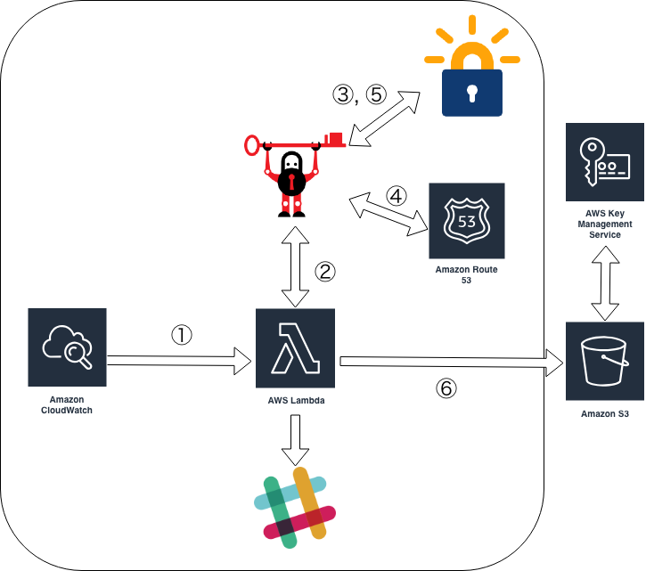

# CertUpdater

 Lambda implementation for automatically getting and uploading to S3 for Let's Encrypt certificates.

## Architecture

## To Use

### Build

`make build`

### Deploy

`make deploy AWS_PROFILE=default BUCKET_NAME=example-certupdater-artifacts`

### Delete Stack

`make delete`

### Local invoke

`make invoke`

## Author

[cohalz](https://github.com/cohalz)